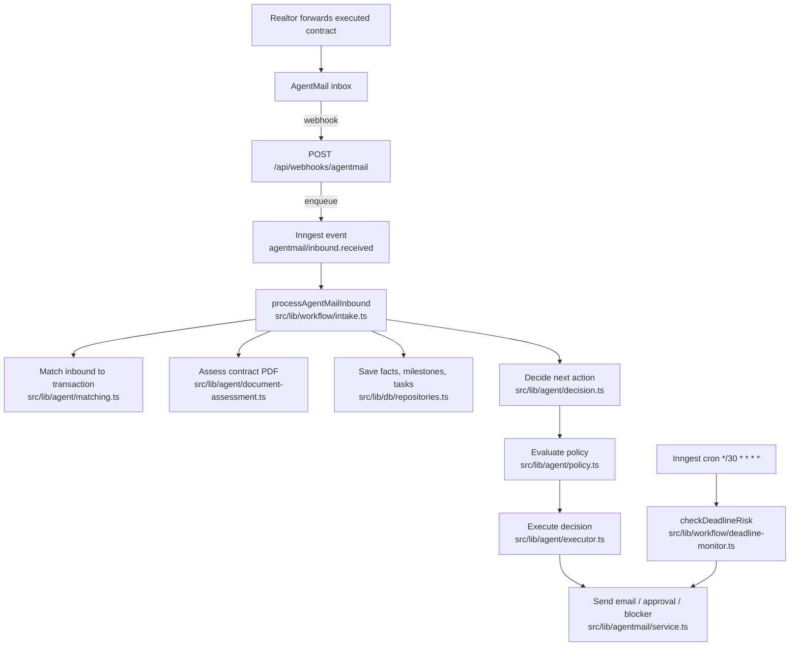

# AGENTS.md

Start here when you need to understand or change this codebase. Read this
file first, then the README of the subsystem you are touching, then the
specific code file. Do not try to scan the whole codebase to "understand
everything" before you change anything.

## What this is

`tc-experiment` is an autonomous AI Transaction Coordinator (TC) prototype
for Texas residential resale real estate. A realtor signs up, the app
provisions a named AgentMail inbox for their TC, the realtor forwards an
executed contract PDF to that inbox, and the system opens a transaction
file, extracts contract facts, generates Texas-specific milestones and
tasks, drafts and sends emails, and escalates deadline risk back to the
realtor.

## System spine

The inbound-email pipeline is the spine of the system. Almost every change
either touches this pipeline directly or one of the modules that feeds it.

## Entry points

| Trigger | Route or schedule | First code file to read |
| --- | --- | --- |
| Inbound email from AgentMail | `POST /api/webhooks/agentmail` | [src/app/api/webhooks/agentmail/route.ts](src/app/api/webhooks/agentmail/route.ts) |
| Inngest worker that processes that email | event `agentmail/inbound.received` | [src/lib/inngest/functions.ts](src/lib/inngest/functions.ts), then [src/lib/workflow/intake.ts](src/lib/workflow/intake.ts) |
| Deadline-risk cron | `*/30 * * * *` | [src/lib/inngest/functions.ts](src/lib/inngest/functions.ts), then [src/lib/workflow/deadline-monitor.ts](src/lib/workflow/deadline-monitor.ts) |
| Realtor signup | `POST /api/signup` | [src/app/api/signup/route.ts](src/app/api/signup/route.ts), then [src/lib/onboarding/service.ts](src/lib/onboarding/service.ts) |
| Realtor approves or rejects a draft | `POST /api/approvals/[approvalId]` | [src/app/api/approvals/[approvalId]/route.ts](src/app/api/approvals/[approvalId]/route.ts) |
| Realtor dashboard | `GET /dashboard/[teamId]` | [src/app/dashboard/[teamId]/page.tsx](src/app/dashboard/[teamId]/page.tsx) |
| Internal observability stream | `GET /observability/[teamId]` | [src/app/observability/[teamId]/page.tsx](src/app/observability/[teamId]/page.tsx) |
| Per-transaction debug view | `GET /transactions/[transactionId]` | [src/app/transactions/[transactionId]/page.tsx](src/app/transactions/[transactionId]/page.tsx) |

## Navigation rule

When you start a task, do this in order:

1. Read this file.
2. Read the README of the subsystem you are touching:
   - [src/lib/agent/README.md](src/lib/agent/README.md) for the decision pipeline.
   - [src/lib/workflow/README.md](src/lib/workflow/README.md) for orchestrators (intake, deadline monitor, contract routing, status responder, tasks).
   - [src/lib/db/README.md](src/lib/db/README.md) for the Postgres data layer.
   - [src/lib/agentmail/README.md](src/lib/agentmail/README.md) for AgentMail inbound / outbound.
   - [src/app/README.md](src/app/README.md) for routes and pages.
3. If your change is inside one of the two long pipeline files, read its
   step-by-step doc first instead of the whole file:
   - [docs/pipelines/intake.md](docs/pipelines/intake.md) for [src/lib/workflow/intake.ts](src/lib/workflow/intake.ts) (~800 lines, ~60% activity logging boilerplate).
   - [docs/pipelines/deadline-monitor.md](docs/pipelines/deadline-monitor.md) for [src/lib/workflow/deadline-monitor.ts](src/lib/workflow/deadline-monitor.ts).
4. For higher-level questions, see [docs/architecture.md](docs/architecture.md). It tags every module as "active" or "stable" and has a "where do I change X?" cheat sheet.

Do not grep-scan the whole repository to "understand everything." The
codebase is small (~7,900 LOC, ~60 files) but two files (`repositories.ts`
at 1336 lines and `intake.ts` at 792 lines) account for a large fraction
of total length and will burn your context budget if you read them
end-to-end. Jump to the relevant section using the README / pipeline doc
instead.

## Other docs worth knowing

- [docs/activity-debugger.md](docs/activity-debugger.md) explains the
  agent observability surfaces and how activity events are written. The
  `lib/agent/activity*.ts` files are observability only and are
  separate from the decision pipeline.
- [README.md](README.md) explains how to install and run locally and the
  required environment variables.
