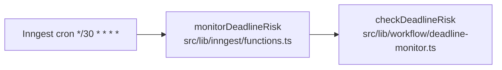

# Deadline monitor pipeline

Step-by-step map of [../../src/lib/workflow/deadline-monitor.ts](../../src/lib/workflow/deadline-monitor.ts).

## Trigger

Registered as an Inngest cron in
[../../src/lib/inngest/functions.ts](../../src/lib/inngest/functions.ts):

`checkDeadlineRisk` is invoked every 30 minutes. There are no other
triggers.

## What it does

`checkDeadlineRisk` runs the following for every milestone whose due
date is within `daysAhead = 2` days from "today" (Central Time), is
not yet completed, and whose transaction is neither `closed` nor
`terminated`.

| Step | Lines | What happens |
| --- | --- | --- |
| 1 | 11–13 | Compute `today` from the app clock ([../../src/lib/time/clock.ts](../../src/lib/time/clock.ts)) |
| 2 | 13 | Query at-risk milestones with `findAtRiskMilestones(2, today)` (see [../../src/lib/db/README.md](../../src/lib/db/README.md)) |
| 3 | 17–31 | Per milestone, log `at_risk_milestone_found` |
| 4 | 32–38 | Insert a `blockers` row (`risk_level = 'critical'` or `'urgent'`) tied to the milestone |
| 5 | 39–54 | Log `deadline_blocker_created` |
| 6 | 56–62 | Render the escalation email body via `agentEscalationEmail` ([../../src/lib/email/templates.ts](../../src/lib/email/templates.ts)) |
| 7 | 64–70 | Send the email to the realtor's escalation address through the TC inbox |
| 8 | 71–87 | Log `deadline_escalation_sent` |
| 9 | 89–98 | Write a `deadline_escalated` audit event |
| 10 | 100–103 | Collect `{ transactionId, blockerId }` into the return array |

The function returns the list of `{ transactionId, blockerId }` pairs
it created.

## What "at risk" means

It is defined by the SQL inside `findAtRiskMilestones` in
[../../src/lib/db/repositories.ts](../../src/lib/db/repositories.ts):

- `m.completed_at is null`
- `m.due_date is not null`
- `m.due_date <= today + daysAhead`
- `t.status not in ('closed', 'terminated')`

To change the lead time, change the constant passed in (`2` today) in
`checkDeadlineRisk`. To change the cadence, change the cron expression
in [../../src/lib/inngest/functions.ts](../../src/lib/inngest/functions.ts).
To change what an escalation email says, edit `agentEscalationEmail` in
[../../src/lib/email/templates.ts](../../src/lib/email/templates.ts).

## What it does **not** do

- It does not de-duplicate. If a milestone is still in the at-risk
  window on the next cron tick, another blocker and another escalation
  email will be created. Any change that wants idempotency belongs
  here.
- It does not consider the cron's own previous outputs; "at risk" is
  computed solely from the milestones table.
- It does not call the LLM. The escalation body is a deterministic
  template.
