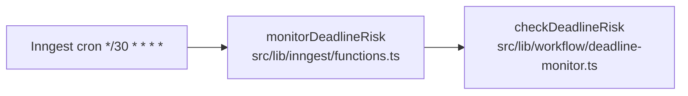

# Deadline monitor pipeline

Step-by-step map of [../../src/lib/workflow/deadline-monitor.ts](../../src/lib/workflow/deadline-monitor.ts).

## Trigger

Registered as an Inngest cron in
[../../src/lib/inngest/functions.ts](../../src/lib/inngest/functions.ts):

`checkDeadlineRisk` is invoked every 30 minutes. It handles both calendar
deadlines and stale response tasks.

## What it does

`checkDeadlineRisk` first handles milestones whose due date is within
`daysAhead = 2` days from "today" (Central Time), is not yet completed,
has no open blocker for that milestone, and whose transaction is neither
`closed` nor `terminated`.

| Step | What happens |
| --- | --- |
| 1 | Compute `today` from the app clock ([../../src/lib/time/clock.ts](../../src/lib/time/clock.ts)) |
| 2 | Query at-risk milestones with `findAtRiskMilestones(2, today)` |
| 3 | Per milestone, log `at_risk_milestone_found` |
| 4 | Insert a blocker tied to the milestone |
| 5 | Send the realtor a deterministic escalation email |
| 6 | Log activity + audit and add the blocker to the return array |

Then it handles stale response tasks from `findStaleResponseTasks(today)`:

| Step | What happens |
| --- | --- |
| 1 | Find `waiting_response` tasks whose `follow_up_due_date <= today` and have no open `blockers.task_id` |
| 2 | Log `stale_response_task_found` |
| 3 | Create a blocker tied to the task |
| 4 | Send the realtor a deterministic escalation email |
| 5 | Log activity + audit and add the blocker to the return array |

The function returns the list of `{ transactionId, blockerId }` pairs
it created.

## What "at risk" means

It is defined by the SQL inside `findAtRiskMilestones` in
[../../src/lib/db/repositories.ts](../../src/lib/db/repositories.ts):

- `m.completed_at is null`
- `m.due_date is not null`
- `m.due_date <= today + daysAhead`
- `t.status not in ('closed', 'terminated')`
- no open blocker already exists for the milestone

Stale response risk is defined by `findStaleResponseTasks`: task status is
`waiting_response`, `follow_up_due_date <= today`, the transaction is open,
and no open blocker already exists for that task.

To change the milestone lead time, change the constant passed in (`2`
today) in `checkDeadlineRisk`. To change cadence, edit the cron expression
in [../../src/lib/inngest/functions.ts](../../src/lib/inngest/functions.ts).
To change escalation copy, edit `agentEscalationEmail` in
[../../src/lib/email/templates.ts](../../src/lib/email/templates.ts).

## Notes

- It de-duplicates by open blocker for milestone/task. Clearing or
  resolving blockers re-enables future escalation if the risk remains.
- It does not call the LLM. "At risk" is
  computed from milestones/tasks plus open blockers.
- The escalation body is a deterministic template.
