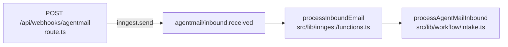

# Intake pipeline

Step-by-step map of [../../src/lib/workflow/intake.ts](../../src/lib/workflow/intake.ts).

This is the longest file in the codebase (~800 lines) and a large fraction
of those lines are `await logActivity(...)` calls used by the observability
debugger. The pipeline itself is much shorter than the file suggests.
Read this doc first, then jump to the line ranges that matter for your
change.

## Trigger chain

`route.ts` verifies the Svix signature, records a `webhook_events` row,
and sends an Inngest event. The Inngest function is one line of glue;
all behavior lives in `intake.ts`.

## What the file contains (top to bottom)

| Lines | What lives here |
| --- | --- |
| 1–39 | Imports |
| 40–59 | Date / email helpers (`isoDateOrUndefined`, `normalizeEmail`, `isFromTcInbox`) |
| 61–75 | `ActivityContext` + `logActivity` wrapper used everywhere in the file |
| 77–96 | `withTransactionContext` — re-loads transaction context after a match changes |
| 98–102 | `documentStatusForUsability` |
| 104–307 | `persistContractAssessment` — long helper that writes facts, milestones, tasks, memory, audit for an assessed contract |
| 309–329 | `storeInboundAttachments` — loop over inbound attachments and persist each |
| 331–end | `processAgentMailInbound` — the actual entry point (everything below) |

## The actual pipeline (inside `processAgentMailInbound`)

Numbered by the order operations run.

| Step | Lines | What happens |
| --- | --- | --- |
| 1 | 335–336 | Normalize the AgentMail event into a `NormalizedInboundEmail` and find the TC profile by inbox id (`normalizeAgentMailInbound`, `findTcProfileByInbox`) |
| 2 | 338–340 | Gate: if the inbox is not known, return `ignored / unknown_inbox` without further work |
| 3 | 342–368 | Self-loop guard: if the inbound came from the TC inbox itself, log `self_authored_email_ignored`, mark the webhook processed, and return |
| 4 | after self-loop guard | Approval-by-reply shortcut: if the realtor replied in a pending approval thread, persist the reply, run `executeApprovalReply`, mark the webhook processed, and return without the generic decision pipeline |
| 5 | after approval shortcut | Build the agent context pack (`buildAgentContextPack`) and seed `transactionId` from the match result |
| 6 | after context | Log inbound: `inbound_email_received`, `tc_profile_resolved`, `transaction_match_completed` (or `..._ambiguous`) |
| 7 | attachment branch | If there are attachments, log `inbound_attachment_found` per attachment |
| 8 | PDF branch | Pick the first PDF attachment (`isPdfAttachment`); fetch it via AgentMail (`fetchIncomingAttachment`); log `contract_pdf_selected` |
| 9 | PDF branch | Run `assessContractDocument` against the fetched PDF; log `contract_extraction_started` and `contract_extraction_completed` |
| 10 | PDF branch | Pull match candidates, call `routeContractIntake`, attach `contractRouting` to the context, log `contract_routing_*` |
| 11 | routing branch | Branch on routing action: `update_transaction` (reuse id), `create_transaction` (`createTransaction` + log `transaction_created`), otherwise clear `transactionId` and mark the match ambiguous |
| 12 | transaction branch | If we now have a `transactionId`: `storeInboundAttachments`, write `contract_pdf_received` audit, call `persistContractAssessment` (which writes facts, milestones, tasks, memory, and more audit) |
| 13 | transaction branch | Reload `transactionContext` using `withTransactionContext` so later steps see the post-routing state |
| 14 | no-PDF branch | If attachments were present but no PDF: log `contract_pdf_missing` + audit event |
| 15 | always | Persist the inbound `messages` row (`createMessage`) and log `message_persisted` |
| 16 | decision branch | Log `decision_requested` |
| 17 | decision branch | Call `decideNextAction` (LLM); if a transaction id is known but the model omitted it, splice it in |
| 18 | decision branch | Persist the `agent_decisions` row (`createAgentDecision`); log `decision_created` |
| 19 | decision branch | `evaluateActionPolicy` and log `policy_evaluated` |
| 20 | execution branch | `executeAgentDecision` (sends email / creates approval / records blocker / etc.) and log `decision_execution_started` and `decision_execution_completed` |
| 21 | always | `markWebhookEventProcessed` |
| 22 | always | Return `{ status, transactionId, intent, action, policy }` or approval-reply result |

## Tips for changing this file

- Adding a new step in the middle of the pipeline almost always means
  adding both the work and one or more `logActivity(...)` calls in the
  same style. Match the surrounding pattern; the observability UI
  depends on it.
- Behavior changes for the contract path usually belong in
  `persistContractAssessment` (lines 104–307), not in the main
  pipeline.
- Behavior changes for matching belong in
  [../../src/lib/agent/matching.ts](../../src/lib/agent/matching.ts) and
  [../../src/lib/workflow/contract-routing.ts](../../src/lib/workflow/contract-routing.ts), not here.
- Anything inside the decision / policy / execution trio belongs in
  `src/lib/agent/{decision,policy,executor,response-writer}.ts`, not
  here. The pipeline only orchestrates them.
- Approval-by-reply behavior belongs in `src/lib/approvals`. Intake
  only detects a pending approval thread from the realtor and routes it
  before the generic decision pipeline.
- The activity log statements are not load-bearing for correctness, but
  the observability doc ([../activity-debugger.md](../activity-debugger.md))
  treats them as the source of truth for "what did the agent do?", so
  removing them silently is a regression.

## Files this pipeline calls

- [../../src/lib/agentmail/inbound.ts](../../src/lib/agentmail/inbound.ts) — `normalizeAgentMailInbound`
- [../../src/lib/approvals/executor.ts](../../src/lib/approvals/executor.ts) — `executeApprovalReply`
- [../../src/lib/agent/context.ts](../../src/lib/agent/context.ts) — `buildAgentContextPack`, `getTransactionContext`
- [../../src/lib/agent/document-assessment.ts](../../src/lib/agent/document-assessment.ts) — `assessContractDocument`
- [../../src/lib/workflow/contract-routing.ts](../../src/lib/workflow/contract-routing.ts) — `routeContractIntake`
- [../../src/lib/documents/attachments.ts](../../src/lib/documents/attachments.ts) — `fetchIncomingAttachment`, `storeIncomingAttachment`, `markStoredAttachmentProcessed`
- [../../src/lib/milestones/engine.ts](../../src/lib/milestones/engine.ts) — `generateTexasMilestones`
- [../../src/lib/workflow/tasks.ts](../../src/lib/workflow/tasks.ts) — `createOpeningTasks`, `createTasksForMilestone`
- [../../src/lib/agent/decision.ts](../../src/lib/agent/decision.ts) — `decideNextAction`
- [../../src/lib/agent/policy.ts](../../src/lib/agent/policy.ts) — `evaluateActionPolicy`
- [../../src/lib/agent/executor.ts](../../src/lib/agent/executor.ts) — `executeAgentDecision`
- [../../src/lib/db/repositories.ts](../../src/lib/db/repositories.ts) — many writes (see [../../src/lib/db/README.md](../../src/lib/db/README.md))
