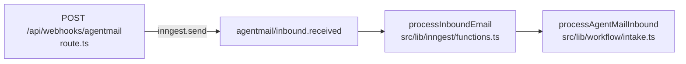

# Intake pipeline

Step-by-step map of [../../src/lib/workflow/intake.ts](../../src/lib/workflow/intake.ts).

This is one of the longest files in the codebase, and many lines are
`await logActivity(...)` calls used by the observability debugger. The
pipeline itself is much shorter than the file suggests. Read this doc
first, then jump by helper/function name.

## Trigger chain

`route.ts` verifies the Svix signature, records a `webhook_events` row,
and sends an Inngest event. The Inngest function is one line of glue;
all behavior lives in `intake.ts`.

## What the file contains (top to bottom)

| Section | What lives here |
| --- | --- |
| Top | Imports and small helpers (`isoDateOrUndefined`, `normalizeEmail`, `isFromTcInbox`) |
| Logging helpers | `ActivityContext` + `logActivity` wrapper used throughout the file |
| Context helpers | `withTransactionContext`, `refreshDealMemory`, and `documentStatusForUsability` |
| Contract persistence | `persistContractAssessment` writes facts, contacts, checklist, milestones, tasks, memory, audit |
| Attachment persistence | `storeInboundAttachments` loops over inbound attachments and persists each |
| Entry point | `processAgentMailInbound` runs the actual pipeline |

## The actual pipeline (inside `processAgentMailInbound`)

Numbered by the order operations run.

| Step | What happens |
| --- | --- |
| 1 | Normalize the AgentMail event and find the TC profile by inbox id |
| 2 | Ignore unknown inboxes and self-authored TC mail |
| 3 | Approval-by-reply shortcut: realtor replies in pending approval threads go to `executeApprovalReply`, refresh transaction memory, and skip generic decisioning |
| 4 | Build the agent context pack and log inbound/matching activity |
| 5 | If attachments exist, log each attachment and assess the first PDF as a possible contract |
| 6 | Route usable contract PDFs to create/update/clarify transaction identity |
| 7 | Store inbound attachments; if this is contract intake, persist facts, contacts, checklist documents, milestones, tasks, memory, and audit |
| 8 | If non-PDF attachments arrive on a matched transaction, store them as transaction documents |
| 9 | Persist the inbound message |
| 10 | Reconcile routine inbound evidence into transaction writes; if anything changed, refresh the deal brief / active questions memory and rebuild context |
| 11 | Call `decideNextAction`; it returns intent/action, inbound event category, optional response (with an optional `taskId` linking the send to an open task), and structured transaction writes |
| 12 | Persist the decision, evaluate policy, execute allowed/approval-gated work, refresh transaction memory, mark the webhook processed, and return. The executor flips the matched task to `waiting_response` on the actual send via [../../src/lib/workflow/task-transitions.ts](../../src/lib/workflow/task-transitions.ts) (directly for inline sends, or through `sendApprovedApproval` once the realtor approves an approval-gated draft) |

## Tips for changing this file

- Adding a new step in the middle of the pipeline almost always means
  adding both the work and one or more `logActivity(...)` calls in the
  same style. Match the surrounding pattern; the observability UI
  depends on it.
- Behavior changes for the contract intake persistence path usually
  belong in `persistContractAssessment`, not in the main pipeline.
- Contact/checklist persistence is driven by `canonicalFactWrites` in
  this file plus `src/lib/transaction-writes`.
- Deal memory refresh belongs in
  [../../src/lib/workflow/memory-refresh.ts](../../src/lib/workflow/memory-refresh.ts).
  Intake calls it after approval replies, evidence reconciliation, and
  decision execution so the next agent run sees a current deal brief.
- Behavior changes for matching belong in
  [../../src/lib/agent/matching.ts](../../src/lib/agent/matching.ts) and
  [../../src/lib/workflow/contract-routing.ts](../../src/lib/workflow/contract-routing.ts), not here.
- Anything inside the decision / policy / execution trio belongs in
  `src/lib/agent/{decision,policy,executor,response-writer}.ts`, not
  here. The pipeline only orchestrates them.
- Approval-by-reply behavior belongs in `src/lib/approvals`. Intake
  only detects a pending approval thread from the realtor and routes it
  before the generic decision pipeline.
- The activity log statements are not load-bearing for correctness, but
  the observability doc ([../activity-debugger.md](../activity-debugger.md))
  treats them as the source of truth for "what did the agent do?", so
  removing them silently is a regression.

## Files this pipeline calls

- [../../src/lib/agentmail/inbound.ts](../../src/lib/agentmail/inbound.ts) — `normalizeAgentMailInbound`
- [../../src/lib/approvals/executor.ts](../../src/lib/approvals/executor.ts) — `executeApprovalReply`
- [../../src/lib/agent/context.ts](../../src/lib/agent/context.ts) — `buildAgentContextPack`, `getTransactionContext`
- [../../src/lib/agent/document-assessment.ts](../../src/lib/agent/document-assessment.ts) — `assessContractDocument`
- [../../src/lib/contracts/checklist.ts](../../src/lib/contracts/checklist.ts) — `buildExpectedDocumentChecklist`
- [../../src/lib/workflow/contract-routing.ts](../../src/lib/workflow/contract-routing.ts) — `routeContractIntake`
- [../../src/lib/documents/attachments.ts](../../src/lib/documents/attachments.ts) — `fetchIncomingAttachment`, `storeIncomingAttachment`, `markStoredAttachmentProcessed`
- [../../src/lib/milestones/engine.ts](../../src/lib/milestones/engine.ts) — `generateTexasMilestones`
- [../../src/lib/workflow/tasks.ts](../../src/lib/workflow/tasks.ts) — `createOpeningTasks`, `createTasksForMilestone`
- [../../src/lib/workflow/memory-refresh.ts](../../src/lib/workflow/memory-refresh.ts) — rewrites the prompt-facing deal brief and active questions/warnings
- [../../src/lib/agent/decision.ts](../../src/lib/agent/decision.ts) — `decideNextAction`
- [../../src/lib/agent/policy.ts](../../src/lib/agent/policy.ts) — `evaluateActionPolicy`
- [../../src/lib/agent/executor.ts](../../src/lib/agent/executor.ts) — `executeAgentDecision`
- [../../src/lib/workflow/task-transitions.ts](../../src/lib/workflow/task-transitions.ts) — `transitionOutboundTaskToWaitingResponse` (called from the executor on a direct send and from the approvals executor on an approved send)
- [../../src/lib/transaction-writes/executor.ts](../../src/lib/transaction-writes/executor.ts) — applies structured state changes from intake and decisions
- [../../src/lib/db/repositories.ts](../../src/lib/db/repositories.ts) — many writes (see [../../src/lib/db/README.md](../../src/lib/db/README.md))
