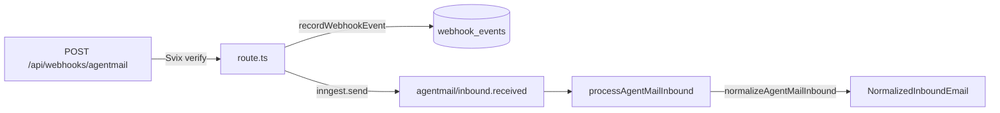
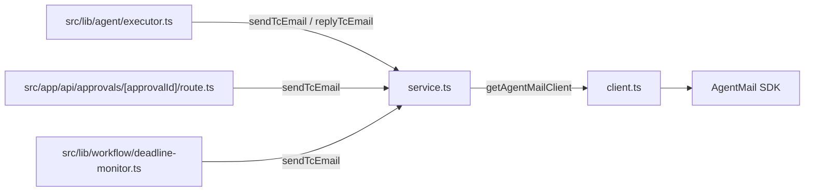

# `src/lib/agentmail` — AgentMail integration

Three small files, one each for inbound, outbound, and the SDK
singleton.

| File | Purpose |
| --- | --- |
| [client.ts](client.ts) | Lazy `AgentMailClient` singleton; reads `AGENTMAIL_API_KEY` via [../config/env.ts](../config/env.ts). |
| [service.ts](service.ts) | All outbound + provisioning operations: `provisionTcInbox`, `sendTcEmail`, `replyTcEmail`, `createTcDraft`, `getTcMessage`, `getTcAttachment`. |
| [inbound.ts](inbound.ts) | Pure mapper: `normalizeAgentMailInbound(event)` returns a `NormalizedInboundEmail` regardless of which casing the webhook used. |

## How inbound flows

The route file in [../../app/api/webhooks/agentmail/route.ts](../../app/api/webhooks/agentmail/route.ts)
does the security work (Svix signature) and idempotency
(`recordWebhookEvent`). All actual interpretation of the payload
happens later, inside `normalizeAgentMailInbound`.

## How outbound flows

Every outbound email goes through `sendTcEmail` (or `replyTcEmail`),
which fans out to `client.inboxes.messages.send` / `.reply`. There is
no other path.

## Provisioning

`provisionTcInbox` is only called from [../onboarding/service.ts](../onboarding/service.ts)
during signup. It creates an inbox with a deterministic username
(`<sanitized agent name>-<teamId prefix>`) on `AGENTMAIL_DOMAIN`,
then returns `{ inboxId, emailAddress, displayName }`.

## Common changes

| Change | File |
| --- | --- |
| Change webhook payload field handling | [inbound.ts](inbound.ts) |
| Change outbound headers / labels behavior | [service.ts](service.ts) |
| Add a new SDK call (e.g. list drafts) | [service.ts](service.ts) wrapping `getAgentMailClient()` |
| Change inbox naming convention | `toInboxUsername` in [service.ts](service.ts) |

## What lives elsewhere

- Signature verification + webhook persistence: [../../app/api/webhooks/agentmail/route.ts](../../app/api/webhooks/agentmail/route.ts).
- Attachment fetch + Vercel Blob storage: [../documents/attachments.ts](../documents/attachments.ts).
- Inbox provisioning trigger: [../onboarding/service.ts](../onboarding/service.ts).
- Reply-loop guard (ignoring self-authored mail): inside [../workflow/intake.ts](../workflow/intake.ts), function `isFromTcInbox`.
